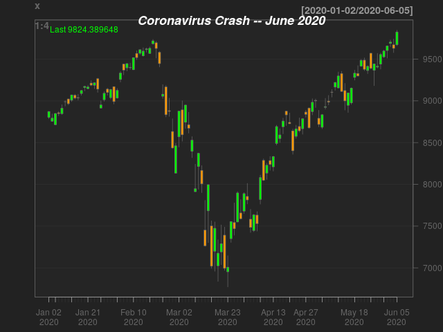
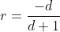
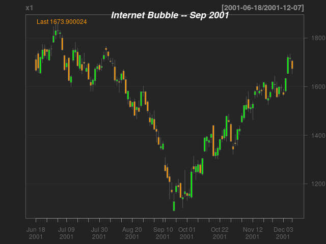

# A Monumental Day in the Stock Market
## -- Jun 5, 2020

Today is a monumental day in the history of stock market. The Nasdaq 100 index, which represents some of the biggest companies in the world, has just completed a round trip. Starting from a record high on Feb 20, it crashed 28% into a bear market, troughed on Mar 19, and rose all the way back to a new record high today. All that happened in 76 days. That's just a little longer than one quarter, and crossed over the reporting period of a typical money manager. With the economy in the dump and corporate earnings disappearing, how could this happen?

Let's not worry about fundamentals for a moment[1] and focus on one "technical" aspect : the fundamental law of bear market progression.

A month ago there was a chorus of bears calling for the market to fall; they were made with a degree of conviction rarely seen in the investment advisory business. One headline reads "_The Crash Has Only Just Begun_(Apr 28)"[2]. Another told investors "_How To Trade a Second Coronavirus Stock Market Crash_(May 5)"[3]. And their reasons are well articulated -- "_4 Reasons Why The Market Will Dive Again_(May 4)"[4]. 

All of these pieces relied on one central belief that a bear market must have three phases. It starts with a sharp decline of more than 20%, to be followed by an equally sharp rebound, then drifts lower until the previous low is "retested". It is only after this "retesting" phase fully played out could a bear market end. Up till now we definitely do not have the last part.

So, is this really unprecedented? 

### No Historic Precedent

Let's look at the data. I coded a R script that searches for similar pattern in historic data. I ran it on the major market indices available on [yahoo finance](https://finance.yahoo.com/), including the amazing 92 years of S&P 500 since 1927, 49 years of Nasdaq Composite, the history of the British market, the German market, and 10 other stock markets around the world [5]. 

Finding : Nothing like this has happened before. No previous example of a drop and then a complete recovery inside four months. There has been some highly volatile trajectories in Nasdaq. The closest ever to a round trip was the path in second half of 2001, during Dot-com Bubble. I'll discuss some coding detail in the last section.

### How is it possible?

I have three observations/hypotheses that I find useful to make sense of what's been happening in the stock market. 

This coronavirus pandemic has created some highly visible damage to the economy. Unlike the subprime crisis in 2008 where the initial impact showed up in some obscure corner of Wall Street, this crisis feels very real. People all over the world could see their neighborhood shops and restaurants closed down. Many people lost their jobs. The fear generated by the shutdown is felt in a broad spectrum of the society. 

As human we have this cognitive mechanism that responds to visible stimulus by taking action. With convenient access to brokerage account, it's so easy to sell everything. One push of a button and you are all in cash and you feel safe. 

So, my first hypothesis is that __behavorial bias__ played a role. Many long term investors might have sold into the decline in the March. As economic data continue to show the enormous damage in the real economy, few of them have moved back into stocks. The market is going up to make sure these people would buy back at some point, at higher prices. I'll write more about this in a separate blog.

The second hypothesis is about the changing mix of stock market participants. It is well documented that as much as 90% of the volume in a typical day is from __HFT algorithms__ taking advantge of some nanosecond price movements. These algorithms don't know and don't care about long term price patterns based on century-old theory of market cycle. An index level such as the 61.8% Fibonacci retracement has no significance to these machine learning models because they are trained on level-agnostic data (ie. returns). Very few machine learning models could learn directly from level data.  And that has to do with the fact that stock prices are inherently nonstationary and are therefore difficult to learn. I'll write more about this very interesting aspect in a separate piece.

However, level data could be useful, but just one needs a large amount of level data to make a model capable enough to generate long term prediction. And that brings me to my third observation : the belief about how a bear market should behave has __very little statistically support__. That's because we have very few data points available to evaluate any hypothesis concerning the progression of a bear market, such as the Dow theory. 

Over the past one hundred years, there were just six bear markets ever occurred in the US, and less than 20 in the developed world[5]. Many of these bear markets lasted a very short time, such as the 1987 stock market crash. And some of them are double-counted. Any model built from 10 or 20 data points have little statistical signficance and a large margin of error. 

Therefore, there is nothing in the data that dictates a third leg in a bear market as believed by many technicians. A bear market that ends with a sharp rally from a single low is as likely as it is not.

### Pattern Search Algorithm
We want to find periods where a descend of more than 20% (that's definition of a bear market) is followed by an advance equal to the initial drop. I use rolling windows of fixed width. The first has duration of 23 days; that's the leg from Feb 19 to Mar 20. The second has 53 days, from Mar 21 to Jun 5. 

People in the investment committee should be familiar with the fact that it takes a bigger percentage to climb back to breakeven. For example, if a stock drops 10%, it needs to go up 11.1% to recover the lost ground. The formula is,

where `r` is the percent of advance and `d` the percent of decline, a negative fraction. We want the second rolling window to be at least `r` given `d`.

### Search Results
Excluding overlaps, there is a total of 17 periods where NDX dropped more than 20% in a 23-day window. And for these 17 instants, only two completely recovered in the next 53 days,

2001-09-20
2020-03-23

The first period is plotted below,

 
### Data Sources
[Yahoo finance](https://finance.yahoo.com/)

### Install Software
To install R, press Ctrl+Alt+T to open a terminal

    sudo apt-get update 
    sudo apt-get install r-base

### Dependencies
Code has been tested on 
* R 3.6.0
* Ubuntu 18.04 

### Contact
To ask questions or report issues, please open an issue on the [issues tracker](https://github.com/htso/Monumental_Day/issues).

References

[1] For a fundamental perspective, I refer the reader to the [piece](https://github.com/htso/bear_market) I wrote during the darkest days of the March selloff.

[1] https://seekingalpha.com/article/4340437-crash-only-just-begun

[2] https://seekingalpha.com/article/4342960-how-to-trade-second-coronavirus-stock-market-crash

[3] https://seekingalpha.com/article/4342645-4-reasons-why-market-will-dive-again

[4] https://seekingalpha.com/article/4342157-continued-selling-for-next-week-losses-set-next

[5] The `quantmod` package in R is amazing; it has the capability to pull large amount of historic time series with one function call. In R command line, type `?getSymbols`.

[6] https://en.wikipedia.org/wiki/List_of_stock_market_crashes_and_bear_markets

